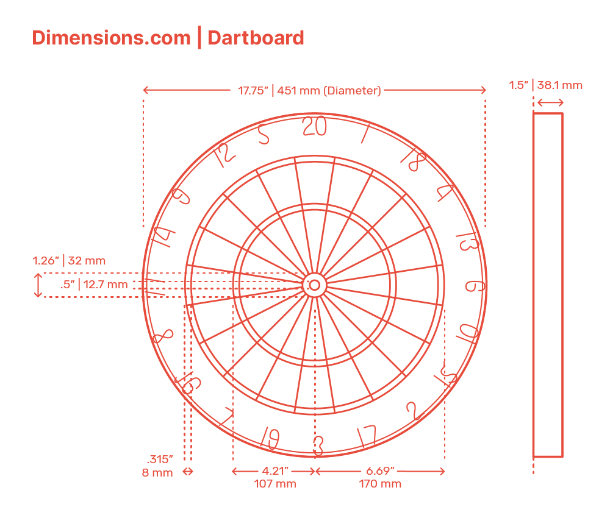

## Dartboard Dimensions

| Measurement                    | Value (mm) | Value (in) |
| ------------------------------ | ---------- | ---------- |
| Width (Full Board Diameter)    | 451 mm     | 17.75”     |
| Bullseye Diameter              | 12.7 mm    | 0.5”       |
| Outer Bullseye Diameter        | 32 mm      | 1.26”      |
| Center to Outside Treble       | 107 mm     | 4.21”      |
| Center to Outside Double       | 170 mm     | 6.69”      |
| Width of Double & Treble Rings | 8 mm       | 0.315”     |

**Design**: 20 Radial Sections

## References

- https://www.dimensions.com/element/dartboard
